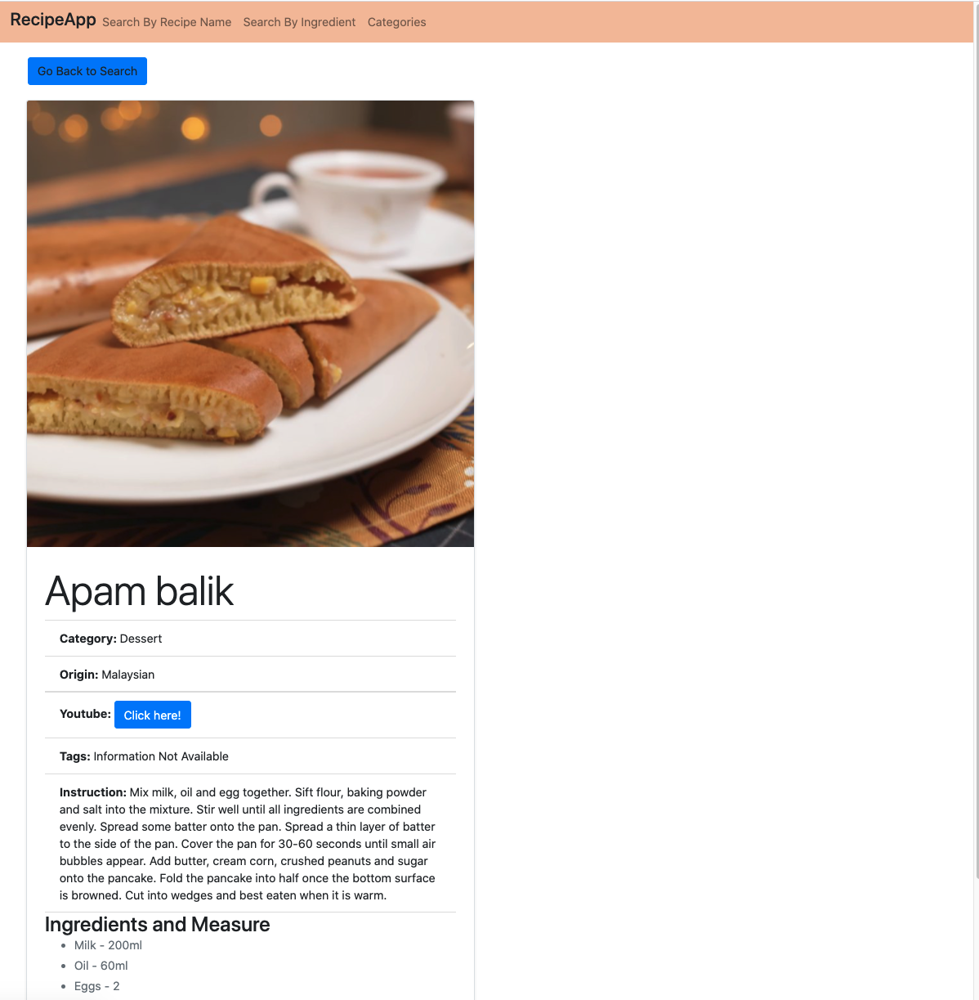

# Recipe App

## Overview 
This application is developed in Python Django framework and offers following functionalities. Each of these functionatities can be accesed by clicking appropriate menu item.

1. Recipe Search by Name - Enter/Select the name of a recipe to display the ingredients and cooking instructions.
2. Recipe Search by Ingredient - Enter/Select an ingredient to display the list of possible recipes. If user click on any recipe, show the ingredients and cooking instructions.
3. Recipe by Categories - Show list of categories. For the selected category, show the list of recipes. Show ingredients and cooking instructions for the selected recipe.

## Data
This application uses sets of API offered in https://www.themealdb.com/api.php to query recipe data.

## Installation and usage

1. `git clone https://github.com/zaranabhalala/RecipeApp.git`
2. `cd RecipeApp`
3. `brew install python3` (to install python in Mac)
4. `pip3 install pipenv`    (Install pipenv to create virtual environment for python.)
5. `pipenv install django`
6. `pipenv shell`
7. `python manage.py runserver 8000`
8. Copy http://127.0.0.1:8000/  and paste in the browser

## Screenshots
### 1.  Search by recipe name (eg. http://127.0.0.1:8000/searchByIngredient/chicken/) </b>

### 2.  Search by Ingredient (eg. http://127.0.0.1:8000/searchByIngredient/milk/)

    
### 3. Recipe Details- after clicking on one of the item in #2 step (eg. http://127.0.0.1:8000/searchById/53049/)

### 4. Categories(eg. http://127.0.0.1:8000/categories/)

   
### 5. Search by categories -  after clicking on one of the item from #4 step (eg. http://127.0.0.1:8000/searchByCategory/Seafood/)

   
### 5. Recipe Details- after clicking on one of the item in #5 step (eg. http://127.0.0.1:8000/searchById/52819/)

   

## Author
- Zarana Bhalala

